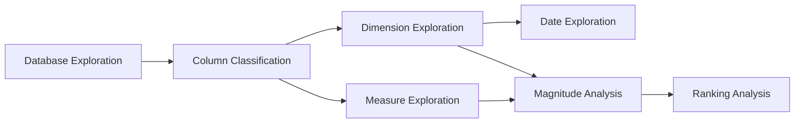

# Data Analysis Portfolio

## Overview

This repository is a portfolio of data analysis projects spanning different business domains — sales, marketing, finance, and operations, among others, depending on which datasets are added over time.

Each project follows the same underlying approach: start from raw data, understand it thoroughly, and arrive at a clear, defensible answer to a specific business question. T-SQL (Microsoft SQL Server) is the primary tool used throughout, and each project moves from exploratory data analysis (EDA) into more targeted business analytics.

### Repository Structure

```
data-analysis-portfolio/
├── project-1-eda-advanced-analytics/
│   ├── scripts/
│   ├── datasets/
│   └── README.md
├── project-2-.../
└── README.md
```

---

## Project 1: Exploratory Data Analysis & Advanced Analytics

### Objective

Before any business question can be answered, the dataset itself needs to be understood — what tables exist, what each column represents, what values it holds, and what time period and scale it covers. This project sets out a step-by-step process for that exploration, then extends it into slightly more advanced analysis (magnitude and ranking) that reflects how business reporting is typically structured.

The process below is intended as a repeatable checklist, applicable to any new dataset rather than only the one used here.

### Key Terms

| Term | Definition | Example |
|---|---|---|
| Dimension | A column used to group or filter data. Typically categorical, or numeric but not meaningful to sum. | `Region`, `ProductCategory`, `CustomerID` |
| Measure | A numeric column that is meaningful to aggregate, such as summing or averaging. | `SalesAmount`, `QuantitySold`, `Revenue` |
| Aggregation | Combining multiple rows into a single summary value, e.g. `SUM()`, `AVG()`, `COUNT()`. | `SUM(SalesAmount)` → total revenue |
| Window function | A function that performs a calculation across a set of rows without collapsing them into one, preserving row-level detail alongside the result. | `RANK() OVER (ORDER BY TotalAmount DESC)` |

### Process



| Step | Description | SQL (T-SQL) | Example result |
|---|---|---|---|
| 1. Database Exploration | Inventory the database before writing any business query: how many tables exist, and what data type each column is. | `SELECT TABLE_NAME, COLUMN_NAME, DATA_TYPE FROM INFORMATION_SCHEMA.COLUMNS ORDER BY TABLE_NAME, ORDINAL_POSITION;` | Two tables identified — `Orders`, which will supply the measures, and `Customers`, which will supply a dimension (`Region`). |
| 2. Column Classification | Classify each column: non-numeric columns are dimensions. Numeric columns are measures only if aggregating them is meaningful; otherwise (e.g. an ID field) they remain dimensions. This determines how each column is used in every subsequent step. | *(logic applied to Step 1's output; no query)* | `SalesAmount` is classified as a measure; `CustomerID` and `Region` are classified as dimensions. |
| 3. Dimension Exploration | List the distinct values within each dimension to confirm what categories exist, and identify any data quality issues early. | `SELECT DISTINCT CategoryColumn FROM dbo.TableName;` | `Region` contains four consistent values: North, South, East, West. |
| 4. Date Exploration | Determine the earliest and latest dates in the data to establish how much history is available. | `SELECT MIN(DateColumn) AS EarliestDate, MAX(DateColumn) AS LatestDate FROM dbo.TableName;` | Data spans January 2021 to December 2024 — four full years, sufficient for trend analysis. |
| 5. Measure Exploration | Aggregate each measure to produce the key totals — the headline metrics most relevant to the business. | `SELECT SUM(AmountColumn) AS TotalAmount FROM dbo.TableName;` | Total sales of approximately 4.58M, serving as the baseline for all subsequent breakdowns. |
| 6. Magnitude Analysis | Break the totals down by dimension to see how each category contributes to the whole. | `SELECT CategoryColumn, SUM(AmountColumn) AS TotalAmount FROM dbo.TableName GROUP BY CategoryColumn ORDER BY TotalAmount DESC;` | The North region accounts for approximately 40% of total sales. |
| 7. Ranking Analysis | Rank categories from highest to lowest to identify top and bottom performers. | `SELECT CategoryColumn, SUM(AmountColumn) AS TotalAmount, RANK() OVER (ORDER BY SUM(AmountColumn) DESC) AS CategoryRank FROM dbo.TableName GROUP BY CategoryColumn;` | Electronics ranks first, approximately 50% ahead of the next category. |

**Note on the queries above:** `INFORMATION_SCHEMA.COLUMNS` is standard in SQL Server and requires no modification. The placeholder names used (`TableName`, `CategoryColumn`, `AmountColumn`, `DateColumn`) avoid SQL Server reserved words such as `TABLE`, `COLUMN`, and `RANK`; replace them with actual, schema-qualified table and column names (e.g. `dbo.Orders`, `SalesAmount`). Where a fixed number of top rows is needed without a window function, SQL Server uses `SELECT TOP N` rather than `LIMIT`.

### Why this order matters

Each step depends on the one before it. Skipping ahead — for example, ranking categories before understanding which columns are dimensions and which are measures — risks building analysis on a flawed premise, such as aggregating an identifier column or grouping by a dimension that contains inconsistent data.

---

## Summary of Findings (Project 1, illustrative)

The figures below are based on the sample data used to demonstrate the process above; they should be replaced with actual results once the queries are run against a real dataset.

| Finding | Detail |
|---|---|
| Total sales | Approximately 4.58M across four years (2021–2024) |
| Top-performing region | North, accounting for approximately 40% of total sales |
| Top-performing category | Electronics, approximately 1.42M, roughly 50% ahead of the second-ranked category |
| Data coverage | Four full years, sufficient for year-over-year trend analysis |

---

## Roadmap

- [x] Project 1 — EDA & Advanced Data Analytics
- [ ] Project 2 — domain to be determined
- [ ] Project 3 — domain to be determined

Future projects will apply this same process to other business areas, such as marketing and finance.
